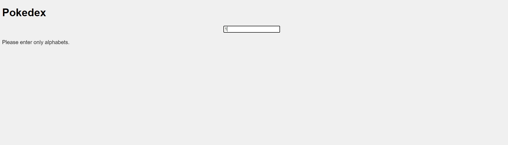

# Pokemon React App
This is a small React application that fetches and displays data from the <a href="https://pokeapi.co/api/v2/pokemon">PokeAPI</a>. The app showcases the following features:

 - Data Display in Cards: Each Pokémon's data is displayed in a visually appealing card format with images.
 - Search Functionality: Users can filter the displayed Pokémon using a search bar.
 - Clean Code: The application is built following standard coding practices, ensuring maintainable and readable code.

## Features
- Fetches Pokémon data from the PokeAPI.
- Displays each Pokémon in a card with an image.
- Allows users to search and filter Pokémon.

## Technologies Used
- React.js
- HTML
- CSS
## Note :'More Details' feature in cards is not implemented yet as it was not part of the assignment.
# Assignment Screenshots
</img>
</img>
</img>
</img>
